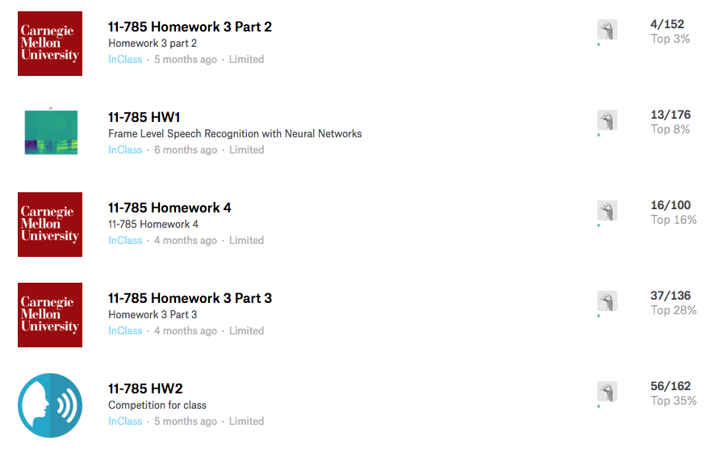

## CMU 11-785 18Spring in-course projects

### Challenge 1: Frame Level Classification of Speech with MLPs

https://www.kaggle.com/c/11785-hw1

code: ./hw1_kaggle

### Challenge 2: Label-aligned Phoneme Level Classification of Speech with CNNs

https://www.kaggle.com/c/11785-hw2pt2

code: in another repo: https://github.com/fanzhenya/ResNet1D-VariableLengthPooling-For-TimeSeries

### Challenge 3: Unalinged Phoneme Level Classification of Speech with LSTM, CTC and Beam Search

https://www.kaggle.com/c/11785-hw3p2

code: ./hw3pt2

### Challenge 4: End-to-End learning from speech to text with LSTM and Attention

code: ./hw4

## Rankings

## References

Credits to the original authors.

- https://github.com/cmudeeplearning11785/deep-learning-tutorials/
- https://github.com/pytorch/examples/
- ...
